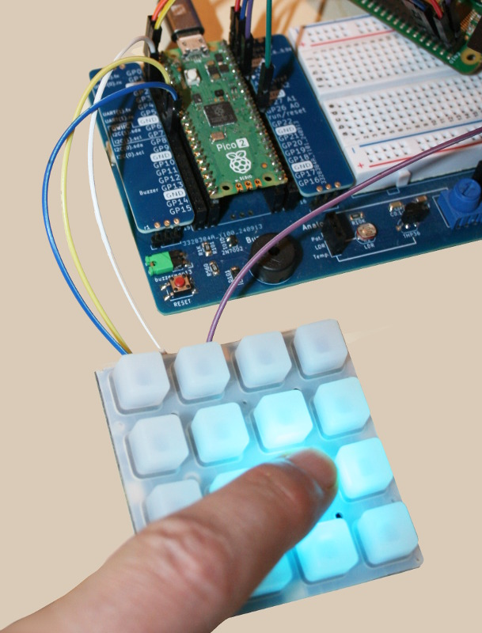

# Adafruit SeeSaw under MicroPython

This repository is an attempt to make Adafruit CircuitPython SeeSaw compatible with MicroPython. The seesaw can be used alone or included within products.

The image below shows the [Adafruit NeoTrellis](https://www.adafruit.com/product/3954), an Adafruit product propelled by SeeSaw on SAMD09.



This MicroPython version of SeeSaw follows the [Hardware Agnostic approch used in the esp8266-upy library collection](https://github.com/mchobby/esp8266-upy) .

Thanks to the __Plateform Agnostic Approach__ this library should work with any MicroPython boards.

## Credit

[https://www.adafruit.com/search?q=seesaw SeeSaw is brand from Adafruit Industries] designed to work with CircuitPython, Wiring (Arduino) and Python.

This repository is based on [Adafruit Seesaw for CircuitPython](https://github.com/adafruit/Adafruit_CircuitPython_seesaw/blob/main/adafruit_seesaw/seesaw.py) (_GitHub, AdaFruit, English_).

## Supported sub-modules

Seesaw includes many modules in the library. The initial portage includes `keypad.py` and `neopixel.py` because it was for for [micropython-neotrellis](https://github.com/mchobby/micropython-neotrellis) .

* keypad.py
* neopixel.py

## Documentation

The original [API documentation](https://docs.circuitpython.org/projects/seesaw/en/latest/) for this library can be found on "Read the Docs". Most of its content also applies to this repository.

## MIT License 

The MIT license applied in the CircuitPython library also applies to MicroPython portage.
See the `[LICENSE](LICENSE)` file.

# Library

The library must be copied on the MicroPython board before using the examples.

On a WiFi capable plateform:

```
>>> import mip
>>> mip.install("github:mchobby/micropython-seesaw")
```

Or via the mpremote utility :

```
mpremote mip install github:mchobby/micropython-seesaw
```

## About install.sh

I do use the `install.sh` bash script to quickly copy the seesaw library (under test) from my computer my micropython board.

# Testing

The seesaw chip connectivity can be checked with the [test_info.py](examples/test_info.py) example. The script just query version information from the seesaw chip.

``` python
from machine import I2C, Pin
from seesaw import Seesaw

# Raspberry Pico: I2C bus 1 
i2c = I2C( 1, sda=Pin.board.GP6, scl=Pin.board.GP7 )

# NeoTrellis is set on address 0x2E by default
s = Seesaw( i2c=i2c, addr=0x2e, drdy=None, reset=True) # NeoTrellis addr, readypin, soft_reset
print( "chip_id     :", s.chip_id )
print( "pid         :", s.get_version()>>16 , "(product id)")
print( "version     :", s.get_version() )
print( "pin_mapping :", s.pin_mapping )
```


The following content show the connection with the NeoTrellis board (propelled by Seesaw on Atmel SAMD09 ).

``` python
$ mpremote run examples/test_info.py 
chip_id     : 85
pid         : 0 (product id)
version     : 9522
pin_mapping : <class 'SAMD09_Pinmap'>
```


# Ressources
* [Adafruit Seesaw for CircuitPython](https://github.com/adafruit/Adafruit_CircuitPython_seesaw/blob/main/adafruit_seesaw/seesaw.py) (_GitHub, AdaFruit, English_)
* [Adafruit Seesaw API](https://seesaw.readthedocs.io/en/latest/api.html) (_readthedocs.io, Adafruit, English_)
* [Adafruit Seesaw Keypad](https://docs.circuitpython.org/projects/seesaw/en/latest/_modules/adafruit_seesaw/keypad.html) 
* [Adafruit Pixelbuf](https://github.com/adafruit/Adafruit_CircuitPython_Pixelbuf)(_GitHub, AdaFruit, English_)